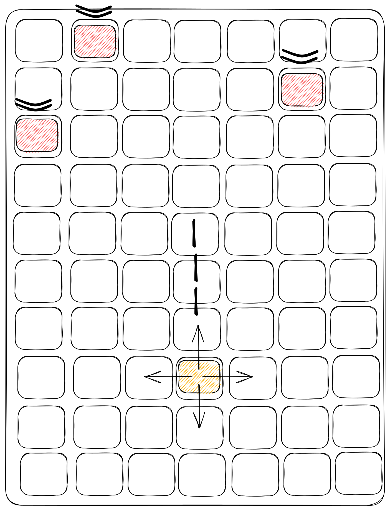

#################

# Project #1 Guidelines : The Game

################

# Introduction - Initial plan

work on space invader Game, on 4 iterations
Space Invaders is a shoot 'em up
It's gonna be done in Vanilla js

- Iteration 1 working on MVP Day - 1
- Iteration 2 update the MVP Day - 2
- Iteration 3 update the MVP Day - 3 and 4
- Iteration 4 make it prettier as possible

# MVP

My MVP should look like this

</img>

Initial plan to reach the MVP

- build a simple container on html page
- deploy a button to start the game or reset the game
- Having a big grid who will be the container for the game, each object on the game will move thanks to this grid
- having a square (representing my spaceship) in it who will be able to move in all direction on the grid
- be able to shoot with this square
- faire une gestion de tir comme ce que l'on a vu en cours
- having a screen where we gonna display some informations (score + time)
- build an instruction page
- Having little boxes dropping from the top of the container
- randomize the fall of these boxes

# Game Components

- index.html: The main HTML file that displays the game board.
- style.css: The CSS file that styles the game components.
- index.js: The main JavaScript file that controls the game logic.
- space-ship.js: The JavaScript file that defines the Spaceship class.
- bullet.js: The JavaScript file that defines the Bullet class.
- asteroid.js: The JavaScript file that defines the Asteroid class.

# How to Play

- Use the left and right arrow keys to move the spaceship.
- Press the spacebar to shoot bullets.
- Avoid colliding with incoming asteroids.
- Destroy as many asteroids as possible.

# Game Logic

The game logic is implemented in the index.js file. It contains the main game loop that updates the positions of all game components and checks for collisions between the spaceship, bullets, and asteroids.

The game loop uses the requestAnimationFrame() method to animate the game components. It updates the positions of the spaceship and asteroids every frame and checks for collisions between the spaceship and asteroids.

When the player shoots a bullet, the game() creates a new Bullet object that moves up the screen. The game checks for collisions between the bullets and asteroids and destroys them if they collide.

index.js :

```javascript
function game() {
  function randomPosition() {}
  function createAsteroid() {}
  function moveBullets() {}
  function moveAsteroids() {}
  function isCollide() {}
  function gameOver() {}
  window.addEventListener();
  function displayTimeRemaining() {}
  function animate() {}
  movement();
}
```

space-ship.js

```javascript
export class Spaceship () {
    constructor () {}
    createSpaceShip () {}
    setPosition () {}
    shoot () {}
    movement() {}
}
```

asteroid.js :

```javascript
export class Asteroid {
    constructor()
    reset() {}
    setPosition() {}
    move () {}
    destroy () {}
    checkCollision () {}
}
```

bullet.js :

```javascript
export class Bullet () {
    constructor() {}
    createBullet () {}
    setPosition () {}
    move () {}
    checkCollision() {}
    destroy ()
}
```

# Technical challenges

collision system
animation
wrap function

# Big mistake

there is so much !!!!!

# Demo

https://tonio9802984.github.io/space-invaders/

# Feature slide

**spaceship movement** is achieved by modifying the CSS properties of its element using the element.style property.

The element is a reference to the spaceship element in the HTML DOM,
created in the createSpaceship() method of the Spaceship class.

The element.style property provides access to the inline CSS styles of the element, allowing you to modify them using JavaScript.

The spaceship is moved using the move() method of the Spaceship class. This method is called repeatedly in the game loop, causing the spaceship to move continuously.

Inside the move() method, the new position of the spaceship is calculated based on its current position and the arrow key input from the user. The x and y properties of the spaceship object are updated accordingly.

Finally, the setPosition() method is called to set the new position of the spaceship element using the element.style property. This method sets CSS properties of the element to the new x and y coordinates, respectively, effectively moving the spaceship on the screen.

# Future Improvements

Add sound effects and background music.
Increase the difficulty level as the player progresses through the game.
Add power-ups and special abilities for the player to use.
Implement a scoring system and a high score leaderboard.

# Conclusion

A lot of fun !!!!
